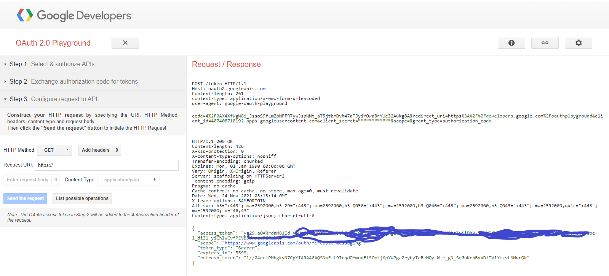

# notification
Dans ce tuto, nous allons illustrer l'utilisation de la notification flutter avec firebase
de google.

## Lien pour la génération de token de cloud messaging

https://stackoverflow.com/questions/50399170/what-bearer-token-should-i-be-using-for-firebase-cloud-messaging-testing/62670409#62670409

